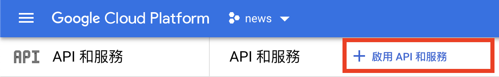

# 使用 Nodejs 操作 Google 試算表
## 工具：Google-spreadsheet
[google-spreadsheet](https://theoephraim.github.io/node-google-spreadsheet/#/)

## 安裝申請 Google Cloud Platform 與創建金鑰

1. 在 Google Search 中，輸入 Google Cloud Platform
2. 看到頂部端，選擇新增專案

3. 新增完之後，選擇左半邊的選單列，再選擇API和服務開啟Google Sheets API

 
4. 新增完API後，我們要建立憑證，然後一路點到完成服務帳戶創建
 
5. 最後我們到IAM與管理中，去創建金鑰（記得這個金鑰的文件類型要選擇JSON）
 

6. 完成之後，去你的Google 雲端試算表，將試算表的共用功能加進服務帳戶的Mail，即可完成整個流程


7. 文字攻略篇
  7-1. [google-spreadSheet](https://theoephraim.github.io/node-google-spreadsheet/#/getting-started/authentication?id=service-account)
  7-2. [官方說明](https://developers.google.com/workspace/guides/create-credentials) 的「Create credentials for a service account」部分

## 疑難雜症篇
### 問題一
```
error:0909006C:PEM routines:get_name:no start line #244
```
### 解答一
```
var creds = require('./google-generated-creds.json');


    doc.useServiceAccountAuth(creds, step);
```
## 使用操作篇
因為你創建金鑰之後，會下載一個檔案，這個檔案決定你是否能連到Google試算表
使用方式如下列code
[官方說明](https://theoephraim.github.io/node-google-spreadsheet/#/getting-started/authentication?id=service-account)
```javascript
const creds = require('./config/myapp-1dd646d7c2af.json'); // the file saved above
const doc = new GoogleSpreadsheet('<YOUR-DOC-ID>');
await doc.useServiceAccountAuth(creds);

// or preferably, load that info from env vars / config instead of the file
await doc.useServiceAccountAuth({
  client_email: process.env.GOOGLE_SERVICE_ACCOUNT_EMAIL,
  private_key: process.env.GOOGLE_PRIVATE_KEY,
});

// example using impersonation - NOTE: your service account must have "domain-wide delegation" enabled
// see https://developers.google.com/identity/protocols/oauth2/service-account#delegatingauthority
await doc.useServiceAccountAuth(creds, 'user.to.impersonate@mycompany.com');
```

